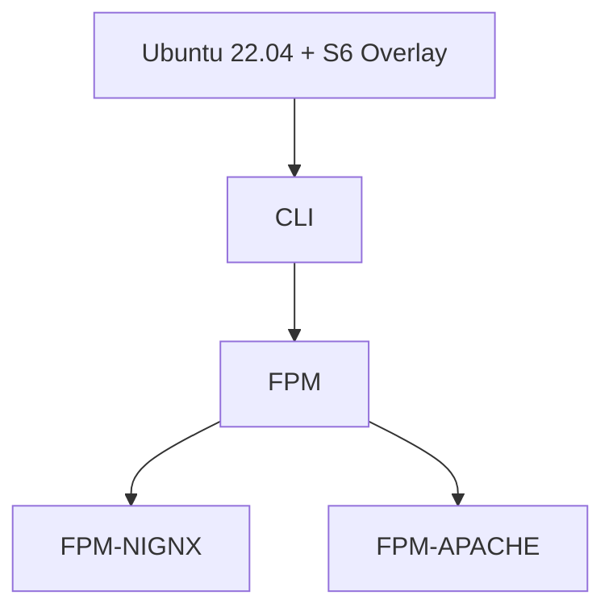

<p align="center">
		
</p>
<p align="center">
	<a href="https://github.com/serversideup/docker-php/actions/workflows/publish_docker-images-production.yml"></a>
	<a href="https://github.com/serversideup/docker-php/blob/main/LICENSE" target="_blank"></a>
	<a href="https://github.com/sponsors/serversideup"></a>
  <br />
  <a href="https://hub.docker.com/r/serversideup/php/"></a>
  <a href="https://community.serversideup.net"></a>
  <a href="https://serversideup.net/discord"></a>
</p>

Hi! We're [Dan](https://twitter.com/danpastori) and [Jay](https://twitter.com/jaydrogers). We're a two person team with a passion for open source products. We created [Server Side Up](https://serversideup.net) to help share what we learn.

### Find us at:

* 📖 [Blog](https://serversideup.net) - get the latest guides and free courses on all things web/mobile development.
* 🙋 [Community](https://community.serversideup.net) - get friendly help from our community members.
* 🤵‍♂️ [Get Professional Help](https://serversideup.net/get-help) - get guaranteed responses within next business day.
* 💻 [GitHub](https://github.com/serversideup) - check out our other open source projects
* 📫 [Newsletter](https://serversideup.net/subscribe) - skip the algorithms and get quality content right to your inbox
* 🐥 [Twitter](https://twitter.com/serversideup) - you can also follow [Dan](https://twitter.com/danpastori) and [Jay](https://twitter.com/jaydrogers)
* ❤️ [Sponsor Us](https://github.com/sponsors/serversideup) - please consider sponsoring us so we can create more helpful resources

### Our Sponsors
All of our software is free an open to the world. None of this can be brought to you without the financial backing of our sponsors.

<p align="center"><a href="https://github.com/sponsors/serversideup"></a></p>

#### Individual Supporters
<!-- supporters --><a href="https://github.com/deligoez"></a>&nbsp;&nbsp;<a href="https://github.com/alexjustesen"></a>&nbsp;&nbsp;<!-- supporters -->

# Available Docker Images
This is a list of the docker images this repository creates:

| ⚙️ Variation | 🚀 Version |
| ------------ | ---------- |
| cli          | [](https://hub.docker.com/r/serversideup/php/tags?name=8.2-cli&page=1&ordering=-name)<br />[](https://hub.docker.com/r/serversideup/php/tags?name=8.1-cli&page=1&ordering=-name)<br />[](https://hub.docker.com/r/serversideup/php/tags?name=8.0-cli&page=1&ordering=-name)<br />[](https://hub.docker.com/r/serversideup/php/tags?name=7.4-cli&page=1&ordering=-name) |
| fpm          | [](https://hub.docker.com/r/serversideup/php/tags?name=8.2-fpm&page=1&ordering=-name)<br />[](https://hub.docker.com/r/serversideup/php/tags?name=8.1-fpm&page=1&ordering=-name)<br />[](https://hub.docker.com/r/serversideup/php/tags?name=8.0-fpm&page=1&ordering=-name)<br />[](https://hub.docker.com/r/serversideup/php/tags?name=7.4-fpm&page=1&ordering=-name) |
| fpm-apache   | [](https://hub.docker.com/r/serversideup/php/tags?name=8.2-fpm-apache&page=1&ordering=-name)<br />[](https://hub.docker.com/r/serversideup/php/tags?name=8.1-fpm-apache&page=1&ordering=-name)<br />[](https://hub.docker.com/r/serversideup/php/tags?name=8.0-fpm-apache&page=1&ordering=-name)<br />[](https://hub.docker.com/r/serversideup/php/tags?name=7.4-fpm-apache&page=1&ordering=-name) |
| fpm-nginx    | [](https://hub.docker.com/r/serversideup/php/tags?name=8.2-fpm-nginx&page=1&ordering=-name)<br />[](https://hub.docker.com/r/serversideup/php/tags?name=8.1-fpm-nginx&page=1&ordering=-name)<br />[](https://hub.docker.com/r/serversideup/php/tags?name=8.0-fpm-nginx&page=1&ordering=-name)<br />[](https://hub.docker.com/r/serversideup/php/tags?name=7.4-fpm-nginx&page=1&ordering=-name) |

### Usage
Simply use this image name pattern in any of your projects:
```sh
serversideup/php:{{version}}-{{variation-name}}
```
For example... If I wanted to run **PHP 8.0** with **FPM + NGINX**, I would use this image:
```sh
serversideup/php:8.0-fpm-nginx
```


### Real-life working example
You can see a bigger picture on how these images are used from Development to Production by viewing this video that shows a high level overview how we deploy "[ROAST](https://roastandbrew.coffee/)" which is a demo production app for [our book](https://serversideup.net/ultimate-guide-to-building-apis-and-spas-with-laravel-and-vuejs/).

Click the image below to view the video:

[](https://www.youtube.com/watch?v=PInGAWnvkjM)

### Updates
✅ The image builds automatically run weekly (Tuesday at 0800 UTC) for latest security updates.

### How these images are built
All images are built off of the official Ubuntu 22.04 docker image. We first build our CLI image, then our FPM, etc. Here is what this looks like:



# Why these images and not other ones?
These images have a few key differences. These images are:

## 🚀 These images are used in production
Our philosophy is: **What you run in production is what you should be running in development.**

You'd be shocked how many people create a Docker image and use it in the local development only. These images are designed with the intention of being deployed to the open and wild Internet.

## 🔧 Optimized for Laravel and WordPress
We have a ton of helpful scripts and security settings configured for managing Laravel and WordPress.

### Automated tasks executed on every container start up
We automatically detect if Laravel is installed and give you the option to enable automatic migrations and apply storage linking.
#### Database Migrations:
```sh
php artisan migrate --force
```
**Automatic migrations are DISABLED by default.** To enable, set an environment variable of `AUTORUN_LARAVEL_MIGRATION=true` on your container. We **do not recommend** enabling this on large or distributed applications. You should run your migrations manually for larger apps.

#### Storage Linking:
```sh
php artisan storage:link
```
**Storage linking is ENABLED by default.** You can disable this behavior by setting `AUTORUN_LARAVEL_STORAGE_LINK=false`.

### Running a Laravel Task Scheduler
We need to run the [schedule:work](https://laravel.com/docs/8.x/scheduling#running-the-scheduler-locally) command from Laravel. Although the docs say "Running the scheduler locally", this is what we want in production. It will run the scheduler in the foreground and execute it every minute. You can configure your Laravel app for the exact time that a command should run through a [scheduled task](https://laravel.com/docs/8.x/scheduling#scheduling-artisan-commands).

**Task Scheduler Command:**
```sh
php artisan schedule:work
```

**Example Docker Compose File:**
```yaml
version: '3'
services:
  php:
    image: my/laravel-app
    environment:
      PHP_POOL_NAME: "my-app_php"

  task:
    image: my/laravel-app
    # Switch to "webuser" before running `php artisan`
    # Declare command in list manner for environment variable expansion
    command: ["su", "webuser", "-c", "php artisan schedule:work"]
    environment:
      PHP_POOL_NAME: "my-app_task"
```

### Running a Laravel Queue
All you need to do is pass the Laravel Queue command to the container and S6 will automatically monitor it for you.

**Task Command:**
```sh
php artisan queue:work --tries=3
```

**Example Docker Compose File:**
```yaml
version: '3'
services:
  php:
    image: my/laravel-app
    environment:
      PHP_POOL_NAME: "my-app_php"

  queue:
    image: my/laravel-app
    # Switch to "webuser" before running `php artisan`
    # Declare command in list manner for environment variable expansion
    command: ["su", "webuser", "-c", "php artisan queue:work --tries=3"]
    environment:
      PHP_POOL_NAME: "my-app_queue"
```

### Running Laravel Horizon with a Redis Queue 
By passing Laravel Horizon to our container, S6 will automatically monitor it.

**Horizon Command:**
```sh
php artisan horizon
```

**Example Docker Compose File:**
```yaml
version: '3'
services:
  php:
    image: my/laravel-app
    environment:
      PHP_POOL_NAME: "my-app_php"

  redis:
    image: redis:6
    command: "redis-server --appendonly yes --requirepass redispassword"

  horizon:
    image: my/laravel-app
    # Switch to "webuser" before running `php artisan`
    # Declare command in list manner for environment variable expansion
    command: ["su", "webuser", "-c", "php artisan horizon"]
    environment:
      PHP_POOL_NAME: "my-app_horizon"
```

## 🔑 WordPress & Security Optimizations
* Hardening of Apache & NGINX included
* Disabling of XML-RPC
* Preventative access to sensitive version control or CI files
* Protection against other common attacks

See our [Apache security.conf](https://raw.githubusercontent.com/serversideup/docker-php/main/php/8.0/fpm-apache/etc/apache2/conf-available/security.conf) and [NGINX security.conf](https://raw.githubusercontent.com/serversideup/docker-php/main/php/8.0/fpm-nginx/etc/nginx/server-opts.d/security.conf) for more detail.

### Examples of running WordPress
If you're looking for a deeper example on how we run our WordPress blog, [Server Side Up](https://serversideup.net), check out this repository for a boilerplate example: https://github.com/serversideup/docker-wordpress

## 🧐 Based off of [S6 Overlay](https://github.com/just-containers/s6-overlay)
S6 Overlay is very helpful in managing a container's lifecycle that has multiple processes.

**Wait... Isn't Docker supposed to be a "single process per container"?** Yes, that's what it's like in a perfect world. Unfortunately PHP isn't like that. You need both a web server and a PHP-FPM server to see your files in order for your application to load.

We follow the [S6 Overlay Philosophy](https://github.com/just-containers/s6-overlay#the-docker-way) on how we can still get a single, disposable, and repeatable image of our application out to our servers.

# Other customizations

### Installing additional PHP extensions
Let's say that we have a basic Docker compose image working in development:
```yaml
version: '3.7'
services:
  php:
    image: serversideup/php:8.0-fpm-nginx
    volumes:
      - .:/var/www/html/:cached
```
Now let's say we want to add the **PHP ImageMagick** extension. To do this, we will use the [docker compose build](https://docs.docker.com/compose/compose-file/compose-file-v3/#build) option in our YAML file.

This means we would need to change our file above to look like:
```yaml
version: '3.7'
services:
  php:
    build:
      context: .
      dockerfile: Dockerfile
    volumes:
      - .:/var/www/html/:cached
```

Notice the `services.php.build` options. We set a `.` to look for a dockerfile called `Dockerfile` within the same directory as our `docker-compose.yml` file.

For extra clarity, my project directory would look like this:
```txt
.
├── Dockerfile
├── docker-compose.yml
└── public
    └── index.php
```
The Dockerfile is where all the magic will happen. This is where we pull the Server Side Up image as a dependency, then run standard Ubuntu commands to add the extension that we need.

**Dockerfile:**
```Dockerfile
# Set our base image
FROM serversideup/php:8.0-fpm-nginx

# Install PHP Imagemagick using regular Ubuntu commands
RUN apt-get update \
    && apt-get install -y --no-install-recommends php8.0-imagick \
    && apt-get clean \
    && rm -rf /var/lib/apt/lists/* /tmp/* /var/tmp/* /usr/share/doc/*
```

The next time you run `docker compose up`, Docker will build and cache the image for you automatically.

You can verify the CLI option installed correctly by echoing out the installed modules. Run this command in a new window **while your containers are running via Docker Compose**:

```sh
docker compose exec php php -m
```

To check that PHP-FPM loaded everything properly, use the [phpinfo()](https://www.php.net/manual/en/function.phpinfo.php) functionally.

#### ⚠️ Important note about caching
* You'll notice Docker likes to cache image builds (which is great for most functions)
* If you make changes to your *Dockerfile*, you may need to include `--build` with your Docker compose command ([read more here](https://docs.docker.com/compose/reference/up/))

If you want to rebuild, then you would run this:
```sh
docker compose up --build
```

#### How do I know which package name to use?
Refer to the official instructions of the extension that you are trying to install. We use Ondrej's PHP repository, so chances are you might be able to find in in here: https://launchpad.net/~ondrej/+archive/ubuntu/php/+packages

Make sure to use the same version number as well. For example... If you are using `8.0` and want to install the **php-imagick** package, use the name `php8.0-imagick` during install (see my examples above).

### Production SSL Configurations
By default, we generate a self-signed certificate for simple local development. For production use, we recommend using  as a proxy to your actual container. 

You have a few options for using SSL in production. **These configurations are only supported in the `php-apache` and `php-nginx` configurations.**

| Value of `$SSL_MODE` | Description |
| --- | --- |
| "off" | This will disable any SSL management and will use HTTP only. Direct all your container traffic to port 80.|
| "mixed" | This will support HTTP and HTTPS connections. You can send traffic to port 80 or 443. |
| "full" (default) | This will provide "end-to-end encryption" to your web server. Any HTTP traffic will be redirected to HTTPS. |

#### Using your own certificates
If you use `mixed` or `full` for your "SSL_MODE", we will check for certificate pairs at the following locations:

1. /etc/ssl/web/ssl.crt
1. /etc/ssl/web/ssl.key

Simply use [Docker Volumes](https://docs.docker.com/storage/volumes/) and mount the `/etc/ssl/web` folder with these two files in that directory.

If we do not find a certificate pair, we will generate a self-signed certificate pair for you.

### The easiest way to get a trusted certificate
1. Use a proxy that supports Let's Encrypt (like [Traefik](https://traefik.io/) or [Caddy](https://caddyserver.com/))
1. Make sure you allow your proxy to direct traffic encrypted with self-signed certificates (if you're proxying to the container with a self-signed certificate)

This is what we do and it's really nice to use the automatic Let's Encrypt SSL management with these products.

# Submitting issues and pull requests
Since there are a lot of dependencies on these images, please understand that it can make it complicated on merging your pull request.

We'd love to have your help, but it might be best to explain your intentions first before contributing.

### Like we said -- we're always learning
If you find a critical security flaw, please open an issue or learn more about [our responsible disclosure policy](https://www.notion.so/Responsible-Disclosure-Policy-421a6a3be1714d388ebbadba7eebbdc8).
